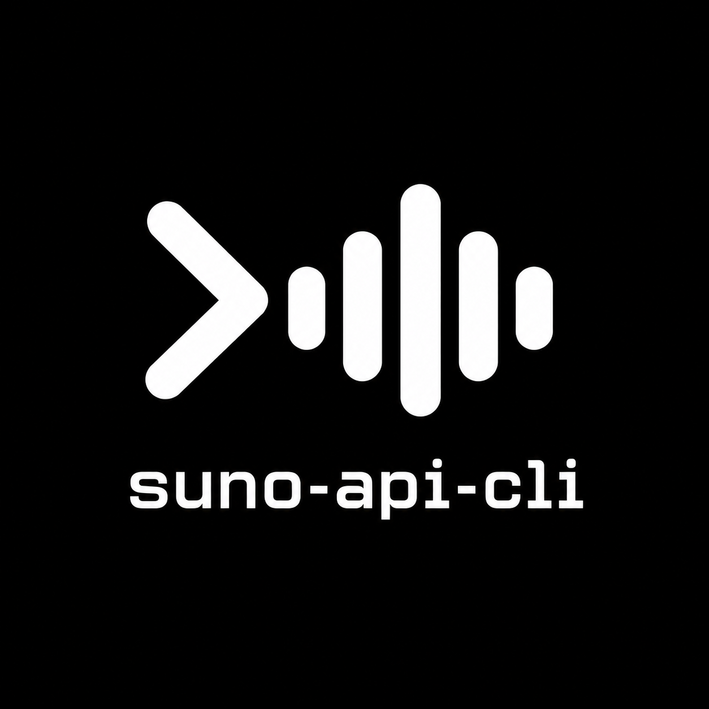

<p align="center">
  
</p>

<p align="center">
  <a href="https://www.npmjs.com/package/suno-api-cli"></a>
  <a href="https://www.npmjs.com/package/suno-api-cli"></a>
  <a href="https://github.com/Microck/suno-api-cli/actions/workflows/ci.yml"></a>
  <a href="LICENSE"></a>
</p>

---

`suno` generates and downloads music through a local [suno-api](https://github.com/gcui-art/suno-api) backend. use your Suno account, renew its browser session, and solve supported CAPTCHAs with 2Captcha. commands return JSON for scripts and agents.

## install

```sh
npm install -g suno-api-cli
suno setup
```

requires Node.js 20+, npm, and Python 3.10+. setup installs the bundled backend and its matching Chromium browser into your user directories. allow about 1 GB of disk space. Linux may also need Chromium system libraries; see [backend setup](docs/backend.md).

## login

log into [suno.com](https://suno.com) in your normal browser. open DevTools > Network, reload the page, and find a request to `auth.suno.com/v1/client`. copy its complete **request Cookie header**, including `__client`, into a private local file. an export of only `suno.com` cookies can miss it.

```sh
suno auth --cookie-stdin < cookie-header.txt
suno auth --captcha-key-stdin < 2captcha-key.txt
suno server run
```

run the following commands in a second terminal. the backend binds to `127.0.0.1:3791`. on Linux with user systemd, `suno server install` installs and starts a background service instead.

```sh
suno status
suno captcha
suno captcha --solve
```

`captcha --solve` spends 2Captcha balance without creating a song. credentials stay in `~/.config/suno-api-cli/credentials.json`. after changing them, restart the backend. keep credential files private and delete temporary copies when finished.

## generate

```sh
suno generate --prompt 'gentle acoustic song about rain' --wait
suno generate --prompt 'ambient piano' --instrumental --wait
suno generate --lyrics-file song.txt --tags 'folk, acoustic' --title Rain --wait
```

generation spends Suno credits and may spend 2Captcha balance. `--model` accepts a model ID; omit it to use the backend default. without `--wait`, the server returns after submission.

## list and download

```sh
suno credits
suno list
suno list TRACK_ID
suno download TRACK_ID --output ./songs
```

downloads require a completed track and refuse to overwrite an existing file. errors go to stderr. a generation timeout does not prove the song failed; check `suno list` before trying again.

## configuration

```sh
suno --api-url http://127.0.0.1:3791 status
suno --timeout 600 generate --prompt 'slow jazz' --wait
suno --help
```

`SUNO_API_URL` sets the default API URL. local credentials are only loaded by the local backend; the client does not forward them to a remote server. `SUNO_BACKEND_DIR` changes the backend directory. `SUNO_PYTHON` selects the Python executable used by the npm launcher.

## limits

this is an unofficial client. Suno can change its private API, session rules, or CAPTCHA providers. renewable authentication and one Turnstile solve were verified live. live song generation and the upstream hCaptcha screenshot solver remain unverified. it does not guarantee that every CAPTCHA will succeed.

the bundled backend uses Next.js development mode and is for local use. it has no API access control; keep it on loopback. upstream logs may contain sensitive request details. do not expose the server or share raw logs.

## development

```sh
npm ci
npm test
npm run check
```

see [backend notes](docs/backend.md) for upstream attribution, patches, and verification. `npm uninstall -g suno-api-cli` removes the CLI. stop and disable any installed systemd service before uninstalling; user data and credentials remain in your home directory.

## license

CLI: MIT. bundled suno-api backend: LGPL-3.0-or-later, with full source and license texts included. Suno and 2Captcha are separate services. this project is not affiliated with Suno.
